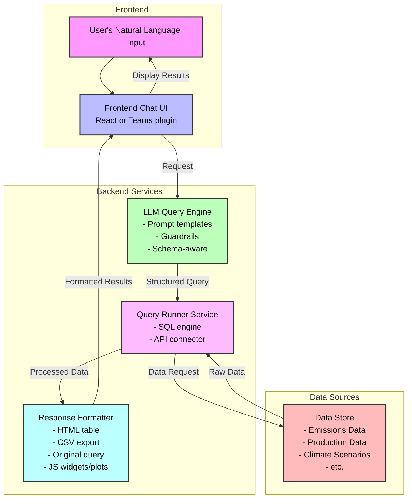

# lucidata: Democratized data access
[](https://github.com/jdhoffa/lucidata/actions/workflows/ci.yml)
[](https://github.com/jdhoffa/lucidata/actions/workflows/build.yml)

Lucidata is an LLM based query tool designed to democratize data access. It translates natural language questions into SQL/API queries over structured datasets, returning clear, traceable answers and exports.

## Features (WIP)

- Natural Language Interface: Ask questions in plain English
- Query Translation: Automatic conversion to SQL/API queries
- Result Visualization: Clear tables and charts
- Export Options: Download results in various formats (CSV, Excel, etc.)
- Query Transparency: Track and export generated queries

## Getting Started

### Prerequisites

- `docker` installed
- OpenAPI `API_KEY`

### Usage

1. Clone the repository
   ```bash
   git clone https://github.com/jdhoffa/lucidata.git
   cd lucidata
   ```

2. Start the application with Docker Compose
   ```bash
   docker compose up
   ```

3. Enter your natural language query in the input field and click "Submit"

4. Review the results and use the export options as needed

## System Architecture

Below is a diagram showing the flow of information and expected user journey:



## Example Queries

```
"What is the projected energy mix in 2030 according to IEA's Net Zero scenario?"

"How does natural gas production in the US compare to China over the next decade in WoodMac's base case?"

"Show me the top 5 countries by renewable energy growth in the next 5 years."
```
