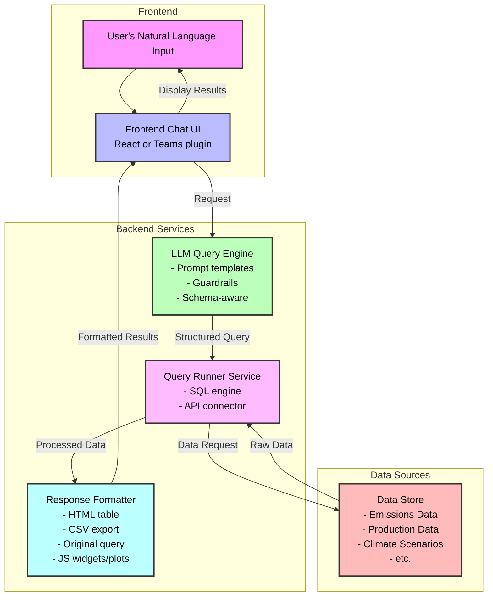

# lucidata: Democratized data access
[](https://github.com/jdhoffa/lucidata/actions/workflows/ci.yml)
[](https://github.com/jdhoffa/lucidata/actions/workflows/build.yml)

Lucidata is an LLM based query tool designed to democratize data access. It translates natural language questions into SQL/API queries over structured datasets, returning clear, traceable answers and exports.

## Features

- Natural Language Interface: Ask questions in plain English
- Query Translation: Automatic conversion to SQL queries
- Query Transparency: Track and export generated queries, explanations, and model confidence

### Road-Map

- Support for Generic WebAPI queries
- Result Visualization

## Getting Started

### Prerequisites

- `docker` installed
- An OpenAPI `API_KEY`

### Usage

1. Clone the repository
   ```bash
   gh repo clone jdhoffa/lucidata
   cd lucidata
   ```

2. Build and start the application with `docker compose`:
   ```bash
   docker compose build # it can take a while to compile, be patient :-)
   docker compose up
   ```

3. Send your query to the query_router endpoint, and check out the results!
``` bash
curl -X POST "http://localhost:8003/translate-and-execute" \
  -H "Content-Type: application/json" \
  -d '{
    "natural_query": "Show me the cars with the best power-to-weight ratio, sorted from highest to lowest"
  }'
```

4. (Optional) Pipe the output to the `jq` CLI:
``` bash
curl -X POST "http://localhost:8003/translate-and-execute" \
  -H "Content-Type: application/json" \
  -d '{
    "natural_query": "Show me the cars with the best power-to-weight ratio, sorted from highest to lowest"
  }' | jq

# you can also select a specific tag
curl -X POST "http://localhost:8003/translate-and-execute" \
  -H "Content-Type: application/json" \
  -d '{
    "natural_query": "Show me the cars with the best power-to-weight ratio, sorted from highest to lowest"
  }' | jq '.results'
```

## System Architecture

Below is a diagram showing the flow of information and expected user journey:



## Example Queries

```
# Query #1 tests mathematical operations (division of hp/wt)
"Show me the cars with the best power-to-weight ratio, sorted from highest to lowest."

# Query #2 tests sorting and multi-column selection
"Compare fuel efficiency (MPG) and horsepower for all cars, sorted by MPG."

# Query #3 tests aggregation functions with grouping
"What's the average horsepower and MPG for automatic vs manual transmission cars?"

# Query #4 tests more complex aggregation and grouping
"Show me the relationship between number of cylinders and fuel efficiency with average MPG by cylinder count"

# Query #5 tests limiting results and specific column selection
"Find the top 5 cars with the highest horsepower and their quarter-mile time (qsec)"
```
